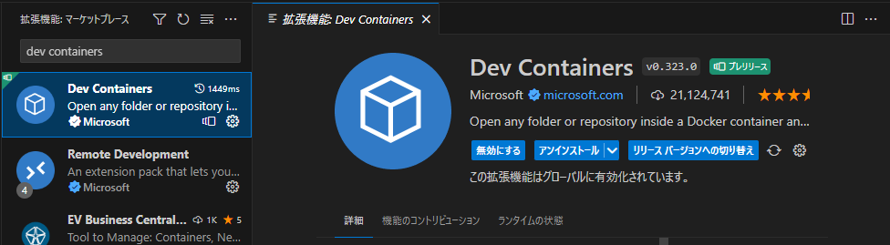
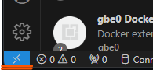
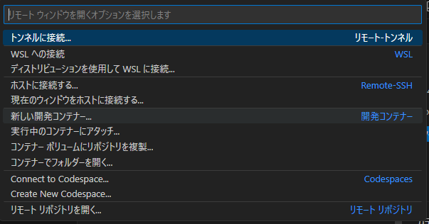

# 開発環境作成手順  
今回の環境作成には以下のソフトウェアをインストールすることが前提となります。
- Docker Desktop(またはDocker)
- Visual Studio Code(以下VSCode)  

また、個人の環境によっては授業の内容を流用することも可能ですが、  
全員の開発環境を統一するためご協力ください。

## 手順
1. Dockerを起動しておきます。
2. VSCodeを開き以下の拡張機能群をインストールします。  
    - `Remote Development`  
    
    
    ※この時複数の拡張機能がダウンロードされますが、今後開発するうえで役に立つと思うので入れておいてください。  

3. インストールの完了後再起動  

4. 起動するとVSCode左下に表示されるリモート接続ボタンを押します。  
      

5. `新しい開発コンテナ`もしくは`New DevContainer`を選択します。  
      

6. `Anaconda (Python3) & PostgreSQL`を選択しDevContainerの作成を選択します。  
    

7. 開発コンテナのダウンロード・ビルド完了まで5~10分ほどかかります、お茶でも飲んで落ち着きましょう。

8. しばらくたったら環境構築は完了です、VSCode内でリポジトリをクローンし開発を始めてください。  
お疲れ様でした。

## 追記
pythonの利用パッケージインストールコマンドは以下のとおりです。  
``` pip install psycopg2-binary flask```